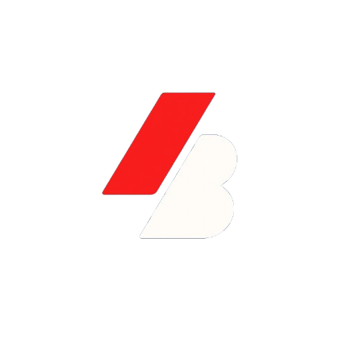

# 🎯 BidNox

<div align="center">
  
  
  ### The Future of Decentralized Sealed-Bid Auctions on Starknet
  
  [](https://scaffoldstark.com/)
  [](https://starknet.io/)
  [](https://nextjs.org/)
  [](https://cairo-lang.org/)
</div>

---

## 📖 What is BidNox?

**BidNox** is a decentralized auction platform built on Starknet that enables secure, transparent, and fair sealed-bid auctions for digital assets. Unlike traditional auctions where bids are visible, BidNox implements a **sealed-bid mechanism** where bid amounts remain completely private until the reveal phase, preventing bid manipulation and ensuring a level playing field for all participants.

### 🎯 The Problem We Solve

Traditional online auctions suffer from several critical issues:

- **Bid Sniping**: Last-second bids that prevent fair competition
- **Price Manipulation**: Visible bids allow strategic manipulation
- **Trust Issues**: Centralized platforms control the entire process
- **High Fees**: Platforms charge significant commissions
- **Lack of Privacy**: All bids are publicly visible

### ✨ The BidNox Solution

BidNox leverages blockchain technology and cryptographic commitments to create a trustless, fair auction environment:

- **🔒 Sealed Bids**: Bids are cryptographically hashed and remain private during bidding
- **⛓️ Blockchain Security**: Smart contracts ensure transparent and immutable execution
- **🚫 Zero Platform Fees**: No commissions, only gas fees for blockchain transactions
- **🎲 Fair Competition**: All participants bid without seeing others' offers
- **📊 Complete Transparency**: All auction rules and outcomes are verifiable on-chain

---

## 🚀 Key Features

### For Sellers

- **📦 Auction Any Digital Asset**: NFTs, gaming items, domain names, tokens, and more
- **⚙️ Customizable Parameters**: Set starting prices, auction duration, and bid reveal periods
- **💰 Guaranteed Payments**: Smart contracts automatically handle fund transfers
- **📈 Maximum Value**: Sealed bids encourage bidders to submit their true maximum price

### For Bidders

- **🔐 Privacy Protection**: Your bid amount stays secret until you choose to reveal it
- **🛡️ Anti-Sniping**: Time-based phases prevent last-second bid manipulation
- **✅ Trustless Process**: No need to trust a third party - the smart contract enforces all rules
- **💎 Fair Pricing**: Bid your true value without fear of being outbid by a small margin

### Technical Features

- **🌐 Decentralized**: Fully on-chain execution on Starknet
- **⚡ Efficient**: Low gas fees thanks to Starknet's ZK-rollup technology
- **🔄 Three-Phase System**: Structured bidding, reveal, and finalization phases
- **📱 Modern UI**: Intuitive interface built with Next.js and TypeScript
- **🔗 Wallet Integration**: Seamless connection with Starknet wallets

---

## 🎲 How BidNox Works

BidNox auctions follow a **three-phase process** to ensure fairness and privacy:

### Phase 1: Bidding 🎯

1. Auction creator sets up the auction with asset details and parameters
2. Bidders submit **commitment hashes** of their bids
3. The hash includes the bid amount + a secret random value
4. All bid amounts remain completely private on the blockchain
5. The platform stores your secret locally for the reveal phase

**Example**:

```
Bid Amount: 100 STRK
Secret: "my-random-secret-123"
Hash: keccak256(100 STRK + "my-random-secret-123")
→ Only the hash is submitted on-chain
```

### Phase 2: Reveal 🔓

1. After the bidding period ends, the reveal phase begins
2. Bidders reveal their actual bid amounts and secrets
3. Smart contract verifies: `hash(revealed_amount + revealed_secret) == stored_hash`
4. Invalid reveals are rejected automatically
5. The highest valid bid is tracked on-chain

### Phase 3: Finalization 🏆

1. Auction creator or anyone can trigger finalization
2. Smart contract identifies the highest bidder
3. Asset ownership is transferred to the winner
4. Payment is transferred to the seller
5. All other bidders can withdraw their deposits

---

## 🛠️ Technology Stack

### Frontend

- **Next.js 15**: React framework with App Router
- **TypeScript**: Type-safe development
- **Tailwind CSS**: Utility-first styling
- **DaisyUI**: Component library
- **Starknet-React**: Wallet connection and contract interaction
- **Starknet.js**: Starknet blockchain interactions

### Smart Contracts

- **Cairo**: Starknet's native smart contract language
- **Starknet Foundry**: Testing and deployment framework
- **OpenZeppelin Cairo**: Secure contract libraries

### Development Tools

- **Scaffold-Stark 2**: Development framework
- **Scarb**: Cairo package manager
- **Yarn**: Package management
- **Git**: Version control

---

## 📦 Project Structure

```
bidnox/
├── packages/
│   ├── nextjs/              # Frontend application
│   │   ├── app/            # Next.js app directory
│   │   │   ├── page.tsx    # Landing page
│   │   │   ├── auction/    # Auction pages
│   │   │   └── ...
│   │   ├── components/     # React components
│   │   ├── hooks/          # Custom React hooks
│   │   │   └── auction/   # Auction-specific hooks
│   │   ├── utils/          # Utility functions
│   │   └── contracts/      # Contract ABIs and addresses
│   │
│   └── snfoundry/          # Smart contracts
│       ├── contracts/      # Cairo contracts
│       │   └── src/
│       │       └── auction_platform.cairo
│       ├── tests/          # Contract tests
│       └── scripts-ts/     # Deployment scripts
│
└── README.md
```

---

## 🚦 Getting Started

### Prerequisites

- Node.js (v18 or higher)
- Yarn (v1 or v2+)
- Git
- Starknet wallet (Argent X or Braavos)

### Installation

1. **Clone the repository**

    ```bash
    git clone https://github.com/yourusername/bidnox.git
    cd bidnox
    ```

2. **Install dependencies**

    ```bash
    yarn install
    ```

3. **Start local development network**

    ```bash
    yarn chain
    ```

    This starts a local Starknet devnet for testing.

4. **Deploy smart contracts** (in a new terminal)

    ```bash
    yarn deploy
    ```

5. **Start the frontend** (in a new terminal)

    ```bash
    yarn start
    ```

6. **Open your browser**
   Navigate to `http://localhost:3000`

---

## 💻 Usage Guide

### Creating an Auction

1. Connect your Starknet wallet
2. Click "Create Auction" in the navigation
3. Fill in auction details:
    - **Asset ID**: Unique identifier for your asset
    - **Starting Price**: Minimum acceptable bid (in STRK)
    - **Duration**: Auction length in seconds
4. Sign the transaction with your wallet
5. Wait for confirmation on Starknet
6. Share your auction link with potential bidders

### Placing a Bid

1. Browse active auctions on the Auctions page
2. Click on an auction to view details
3. Connect your wallet
4. Enter your bid amount
5. The platform generates a cryptographic commitment
6. Sign the transaction to submit your sealed bid
7. Your secret is stored locally for later reveal

### Revealing Your Bid

1. Return to the auction after the bidding phase ends
2. Click "Reveal Bid"
3. The platform retrieves your stored secret
4. Sign the transaction to reveal your bid
5. Smart contract verifies your commitment hash

### Finalizing an Auction

1. After the reveal phase, anyone can finalize
2. Click "Finalize Auction"
3. Smart contract determines the winner
4. Asset and funds are automatically transferred
5. Non-winning bidders can withdraw their deposits

---

## 📜 Smart Contract Details

### Auction Platform Contract

**Location**: `packages/snfoundry/contracts/src/auction_platform.cairo`

#### Key Functions

**Creating Auctions**

```cairo
fn create_auction(
    asset_id: u256,
    starting_price: u256,
    duration: u64
)
```

**Placing Bids**

```cairo
fn place_bid(
    auction_id: u256,
    bid_hash: felt252
)
```

**Revealing Bids**

```cairo
fn reveal_bid(
    auction_id: u256,
    amount: u256,
    secret: felt252
)
```

**Finalizing Auctions**

```cairo
fn finalize_auction(auction_id: u256)
```

#### Security Features

- ✅ Reentrancy protection
- ✅ Commitment verification
- ✅ Time-based phase enforcement
- ✅ Overflow/underflow prevention
- ✅ Access control for critical functions

---

## 🧪 Testing

### Run Smart Contract Tests

```bash
cd packages/snfoundry
scarb test
```

### Run Frontend Tests

```bash
cd packages/nextjs
yarn test
```

---

## 🌐 Deployment

### Deploy to Starknet Testnet

1. **Configure your account**

    ```bash
    cd packages/snfoundry
    ```

    Create a `.env` file:

    ```env
    ACCOUNT_ADDRESS_SEPOLIA=0x...
    PRIVATE_KEY_SEPOLIA=0x...
    ```

2. **Deploy contracts**

    ```bash
    yarn deploy --network sepolia
    ```

3. **Update frontend configuration**
   The deployment automatically updates `packages/nextjs/contracts/deployedContracts.ts`

4. **Deploy frontend to Vercel**
    ```bash
    cd packages/nextjs
    yarn vercel
    ```

---

## 🤝 Contributing

We welcome contributions to BidNox! Here's how you can help:

1. Fork the repository
2. Create a feature branch (`git checkout -b feature/amazing-feature`)
3. Commit your changes (`git commit -m 'Add amazing feature'`)
4. Push to the branch (`git push origin feature/amazing-feature`)
5. Open a Pull Request

### Development Guidelines

- Follow the existing code style
- Write tests for new features
- Update documentation as needed
- Ensure all tests pass before submitting PR

---

## 🔐 Security

### Reporting Vulnerabilities

If you discover a security vulnerability, please email us at security@bidnox.io instead of using the issue tracker.

### Security Best Practices

- Never share your wallet private keys
- Always verify transaction details before signing
- Keep your bid secrets secure
- Use strong, random secrets for your bids

---

## 📄 License

This project is licensed under the MIT License - see the [LICENSE](LICENSE) file for details.

---

## 🙏 Acknowledgments

- Built with [Scaffold-Stark 2](https://scaffoldstark.com/)
- Powered by [Starknet](https://starknet.io/)
- Inspired by sealed-bid auction theory and cryptographic commitment schemes
- Thanks to the Starknet and Cairo communities

---

## 📞 Contact & Support

- **Website**: [bidnox.io](https://bidnox.io)
- **Twitter**: [@BidNox](https://twitter.com/bidnox)
- **Discord**: [Join our community](https://discord.gg/bidnox)
- **Email**: hello@bidnox.io

---

## 🗺️ Roadmap

### Phase 1: Core Platform (Current)

- ✅ Sealed-bid auction mechanism
- ✅ Three-phase auction process
- ✅ Starknet smart contracts
- ✅ Modern web interface

### Phase 2: Enhanced Features

- 🔄 NFT integration
- 🔄 Multi-token support
- 🔄 Auction templates
- 🔄 Advanced analytics

### Phase 3: Ecosystem Growth

- 📋 Mobile application
- 📋 Auction aggregator
- 📋 API for third-party integrations
- 📋 Governance token

### Phase 4: Advanced Capabilities

- 📋 Cross-chain auctions
- 📋 Batch auctions
- 📋 Auction insurance
- 📋 Reputation system

---

<div align="center">
  <p>Built with ❤️ on Starknet</p>
  <p>© 2025 BidNox. All rights reserved.</p>
</div>
